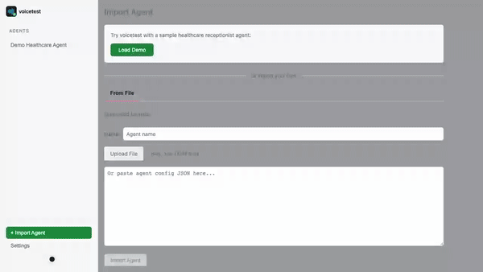

[](https://github.com/pld/voicetest/actions/workflows/test.yml)

<picture>
  <source media="(prefers-color-scheme: dark)" srcset="assets/logo-dark.svg">
  <source media="(prefers-color-scheme: light)" srcset="assets/logo-light.svg">
  
</picture>

### 

A generic test harness for voice agent workflows. Test agents from Retell, VAPI, LiveKit, Bland, and custom sources using a unified execution and evaluation model.

## Installation

```bash
pip install voicetest
```

Or with uv (as a global CLI tool):

```bash
uv tool install voicetest
```

Or add to a project (use `uv run voicetest` to run):

```bash
uv add voicetest
```

## Quick Demo

Try voicetest with a sample healthcare receptionist agent and tests:

```bash
# Set up an API key (get a free one at https://openrouter.ai)
export OPENROUTER_API_KEY=sk-or-v1-...

# Load demo and start interactive shell
voicetest demo

# Or load demo and start web UI
voicetest demo --serve
```

The demo includes a healthcare receptionist agent with 8 test cases covering appointment scheduling, identity verification, and more.




## Quick Start

### Interactive Shell

```bash
# Launch interactive shell (default)
uv run voicetest

# In the shell:
> agent tests/fixtures/retell/sample_agent.json
> tests tests/fixtures/retell/sample_tests.json
> set agent_model ollama_chat/qwen2.5:0.5b
> run
```

### CLI Commands

```bash
# List available importers
voicetest importers

# Run tests against an agent definition
voicetest run --agent agent.json --tests tests.json

# Export agent to different formats
voicetest export --agent agent.json --format mermaid         # Diagram
voicetest export --agent agent.json --format livekit         # Python code
voicetest export --agent agent.json --format retell-llm      # Retell LLM JSON
voicetest export --agent agent.json --format retell-cf       # Retell Conversation Flow JSON
voicetest export --agent agent.json --format vapi-assistant  # VAPI Assistant JSON
voicetest export --agent agent.json --format vapi-squad      # VAPI Squad JSON
voicetest export --agent agent.json --format bland           # Bland AI JSON

# Launch full TUI
voicetest tui --agent agent.json --tests tests.json

# Start REST API server with Web UI
voicetest serve
```

### Web UI

Start the server and open http://localhost:8000 in your browser:

```bash
voicetest serve
```

The web UI provides:

- Agent import and graph visualization
- Export agents to multiple formats (Mermaid, LiveKit, Retell, VAPI, Bland)
- Platform integration: import agents from and push agents to Retell, VAPI, Bland, LiveKit
- Test case management with persistence
- Export tests to platform formats (Retell)
- Global metrics configuration (compliance checks that run on all tests)
- Test execution with real-time streaming transcripts
- Cancel in-progress tests
- Run history with detailed results
- Transcript and metric inspection with scores
- Settings configuration (models, max turns, streaming)

Data is persisted to `.voicetest/data.duckdb` (configurable via `VOICETEST_DB_PATH`).

### REST API

The REST API is available at http://localhost:8000/api when running `voicetest serve`:

```bash
# Health check
curl http://localhost:8000/api/health

# List agents
curl http://localhost:8000/api/agents

# Get agent with graph
curl http://localhost:8000/api/agents/{id}/graph

# List tests for agent
curl http://localhost:8000/api/agents/{id}/tests

# Start a test run
curl -X POST http://localhost:8000/api/agents/{id}/runs \
  -H "Content-Type: application/json" \
  -d '{"test_ids": ["test-1", "test-2"]}'

# Get run with results
curl http://localhost:8000/api/runs/{id}

# Get/update agent metrics configuration
curl http://localhost:8000/api/agents/{id}/metrics-config
curl -X PUT http://localhost:8000/api/agents/{id}/metrics-config \
  -H "Content-Type: application/json" \
  -d '{"threshold": 0.8, "global_metrics": [{"name": "HIPAA", "criteria": "Check compliance", "enabled": true}]}'

# Export test cases to platform format
curl -X POST http://localhost:8000/api/agents/{id}/tests/export \
  -H "Content-Type: application/json" \
  -d '{"format": "retell"}'

# WebSocket for real-time updates
wscat -c ws://localhost:8000/api/runs/{id}/ws

# Platform integration (Retell, VAPI, Bland, LiveKit)
curl http://localhost:8000/api/platforms                              # List platforms
curl http://localhost:8000/api/platforms/retell/status                # Check connection
curl -X POST http://localhost:8000/api/platforms/retell/configure \   # Configure API key
  -H "Content-Type: application/json" \
  -d '{"api_key": "key_..."}'
curl http://localhost:8000/api/platforms/retell/agents                # List remote agents
curl -X POST http://localhost:8000/api/platforms/retell/agents/{id}/import  # Import agent
curl -X POST http://localhost:8000/api/platforms/retell/export \      # Push agent to platform
  -H "Content-Type: application/json" \
  -d '{"agent_id": "local-agent-id"}'
```

WebSocket messages:

- Server → Client: `test_started`, `transcript_update`, `test_completed`, `run_completed`
- Client → Server: `cancel_test` (with `result_id`), `cancel_run`

## Format Conversion

voicetest can convert between agent formats via its unified AgentGraph representation:

```
Retell CF ─────┐                  ┌───▶ Retell LLM
               │                  │
Retell LLM ────┼                  ├───▶ Retell CF
               │                  │
VAPI ──────────┼───▶ AgentGraph ──┼───▶ VAPI
               │                  │
Bland ─────────┤                  ├───▶ Bland
               │                  │
LiveKit ───────┤                  ├───▶ LiveKit
               │                  │
XLSForm ───────┤                  └───▶ Mermaid
               │
Custom ────────┘
```

Import from any supported format, then export to any other:

```bash
# Convert Retell Conversation Flow to Retell LLM format
voicetest export --agent retell-cf-agent.json --format retell-llm > retell-llm-agent.json

# Convert VAPI assistant to Retell LLM format
voicetest export --agent vapi-assistant.json --format retell-llm > retell-agent.json

# Convert Retell LLM to VAPI format
voicetest export --agent retell-llm-agent.json --format vapi > vapi-agent.json
```

## Test Case Format

Test cases follow the Retell export format:

```json
[
  {
    "name": "Customer billing inquiry",
    "user_prompt": "## Identity\nYour name is Jane.\n\n## Goal\nGet help with a charge on your bill.",
    "metrics": ["Agent greeted the customer and addressed the billing concern"],
    "dynamic_variables": {},
    "tool_mocks": [],
    "type": "simulation"
  }
]
```

## Features

- **Multi-source import**: Retell CF, Retell LLM, VAPI, Bland, LiveKit, XLSForm, custom Python functions
- **Format conversion**: Convert between Retell, VAPI, Bland, LiveKit, and other formats
- **Unified IR**: AgentGraph representation for any voice agent
- **Multi-format export**: Mermaid diagrams, LiveKit Python, Retell LLM, Retell CF, VAPI, Bland
- **Platform integration**: Import from and push agents to Retell, VAPI, Bland, LiveKit via API
- **Configurable LLMs**: Separate models for agent, simulator, and judge
- **DSPy-based evaluation**: LLM judges with reasoning and 0-1 scores
- **Global metrics**: Define compliance checks that run on all tests for an agent
- **Multiple interfaces**: CLI, TUI, interactive shell, Web UI, REST API
- **Persistence**: DuckDB storage for agents, tests, and run history
- **Real-time streaming**: WebSocket-based transcript streaming during test execution
- **Token streaming**: Optional token-level streaming as LLM generates responses (experimental)
- **Cancellation**: Cancel in-progress tests to stop token usage

## Global Metrics

Global metrics are compliance-style checks that run on every test for an agent. Configure them in the "Metrics" tab in the Web UI.

Each agent has:

- **Pass threshold**: Default score (0-1) required for metrics to pass (default: 0.7)
- **Global metrics**: List of criteria evaluated on every test run

Each global metric has:

- **Name**: Display name (e.g., "HIPAA Compliance")
- **Criteria**: What the LLM judge evaluates (e.g., "Agent must verify patient identity before sharing medical information")
- **Threshold override**: Optional per-metric threshold (uses agent default if not set)
- **Enabled**: Toggle to skip without deleting

Example use cases:

- HIPAA compliance checks for healthcare agents
- PCI-DSS validation for payment processing
- Brand voice consistency across all conversations
- Safety guardrails and content policy adherence

## Platform Integration

voicetest can connect directly to voice platforms to import and push agent configurations.

### Supported Platforms

| Platform | Import | Push | API Key Env Var                          |
| -------- | ------ | ---- | ---------------------------------------- |
| Retell   | ✓      | ✓    | `RETELL_API_KEY`                         |
| VAPI     | ✓      | ✓    | `VAPI_API_KEY`                           |
| Bland    | ✓      | ✓    | `BLAND_API_KEY`                          |
| LiveKit  | ✓      | ✓    | `LIVEKIT_API_KEY` + `LIVEKIT_API_SECRET` |

### Usage

In the Web UI, go to the "Platforms" tab to:

1. **Configure** - Enter API keys (stored in settings, not in env)
1. **Browse** - List agents on the remote platform
1. **Import** - Pull an agent config into voicetest for testing
1. **Push** - Deploy a local agent to the platform

API keys can also be set via environment variables or in the Settings page.

## CI/CD Integration

Run voice agent tests in CI to catch regressions before they reach production. Key benefits:

- **Bring your own LLM keys** - Use OpenRouter, OpenAI, etc. directly instead of paying per-minute through Retell/VAPI's built-in LLM interfaces
- **Test on prompt changes** - Automatically validate agent behavior when prompts or configs change
- **Track quality over time** - Ensure consistent agent performance across releases

Example GitHub Actions workflow (see [docs/examples/ci-workflow.yml](docs/examples/ci-workflow.yml)):

```yaml
name: Voice Agent Tests
on:
  push:
    paths: ["agents/**"]  # Trigger on agent config or test changes

jobs:
  test:
    runs-on: ubuntu-latest
    steps:
      - uses: actions/checkout@v4
      - uses: astral-sh/setup-uv@v5
      - run: uv tool install voicetest
      - run: voicetest run --agent agents/receptionist.json --tests agents/tests.json --all
        env:
          OPENROUTER_API_KEY: ${{ secrets.OPENROUTER_API_KEY }}
```

## LLM Configuration

Configure different models for each role using [LiteLLM format](https://docs.litellm.ai/docs/providers):

```python
from voicetest.models.test_case import RunOptions

options = RunOptions(
    agent_model="openai/gpt-4o-mini",
    simulator_model="gemini/gemini-1.5-flash",
    judge_model="anthropic/claude-3-haiku-20240307",
    max_turns=20,
)
```

Or use Ollama for local execution:

```python
options = RunOptions(
    agent_model="ollama_chat/qwen2.5:0.5b",
    simulator_model="ollama_chat/qwen2.5:0.5b",
    judge_model="ollama_chat/qwen2.5:0.5b",
)
```

In the shell:

```
> set agent_model gemini/gemini-1.5-flash
> set simulator_model ollama_chat/qwen2.5:0.5b
```

## Development

```bash
# Clone and install
git clone https://github.com/pld/voicetest
cd voicetest
uv sync --all-extras

# Run unit tests
uv run pytest tests/unit

# Run integration tests (requires Ollama with qwen2.5:0.5b)
uv run pytest tests/integration

# Lint
uv run ruff check voicetest/ tests/
```

### LiveKit CLI

LiveKit integration tests require the `lk` CLI tool for agent deployment and listing operations. Install it from https://docs.livekit.io/home/cli/cli-setup/

```bash
# macOS
brew install livekit-cli

# Linux
curl -sSL https://get.livekit.io/cli | bash
```

Tests that require the CLI will skip automatically if it's not installed.

### Frontend Development

The web UI is built with Bun + Svelte + Vite. Uses [mise](https://mise.jdx.dev/) for version management.

```bash
# Terminal 1 - Frontend dev server with hot reload
cd web
mise exec -- bun install
mise exec -- bun run dev   # http://localhost:5173

# Terminal 2 - Backend API
uv run voicetest serve --reload   # http://localhost:8000
```

The Vite dev server proxies `/api/*` to the FastAPI backend.

```bash
# Run frontend tests
cd web && npx vitest run

# Build for production
cd web && mise exec -- bun run build
```

## Project Structure

```
voicetest/
├── voicetest/           # Python package
│   ├── api.py           # Core API
│   ├── cli.py           # CLI
│   ├── rest.py          # REST API server + WebSocket + SPA serving
│   ├── container.py     # Dependency injection (Punq)
│   ├── models/          # Pydantic models
│   ├── importers/       # Source importers (retell, vapi, bland, livekit, xlsform, custom)
│   ├── exporters/       # Format exporters (mermaid, livekit, retell, vapi, bland, test_cases)
│   ├── platforms/       # Platform SDK clients (retell, vapi, bland, livekit)
│   ├── engine/          # Execution engine
│   ├── simulator/       # User simulation
│   ├── judges/          # Evaluation judges (metric, flow, rule)
│   ├── storage/         # DuckDB persistence layer
│   └── tui/             # TUI and shell
├── web/                 # Frontend (Bun + Svelte + Vite)
│   ├── src/
│   │   ├── components/  # Svelte components
│   │   └── lib/         # API client, stores, types
│   └── dist/            # Built assets (bundled in package)
├── tests/
│   ├── unit/            # Unit tests
│   └── integration/     # Integration tests (Ollama)
└── docs/
    └── M2_SPEC.md       # Future roadmap
```

## License

Apache 2.0
